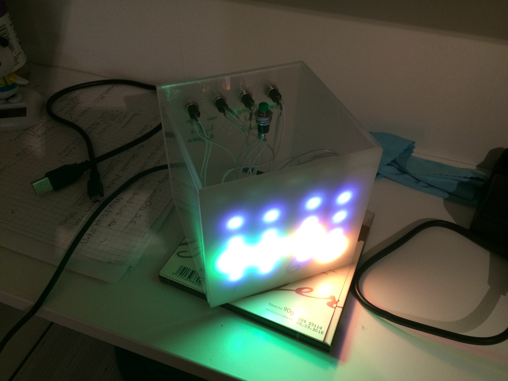
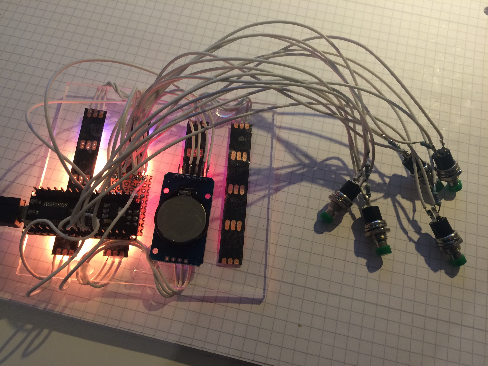
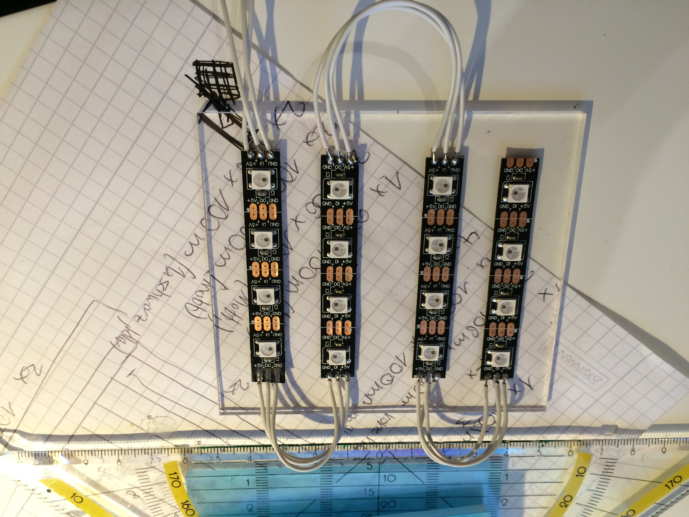

# SimpleArduinoBinaryClock
Arduino based binary clock with hours and minutes display, nightmode and alarm.
It uses a Arsuino Nano and the WS2812 Leds,to show the time in a binary format.
The time, alarm time and nightmode time, can be set by the 4 switches on the back of the clock.
With the top button, you can change the color and stop the ringing alarm.
In my version of the clock, it comes with a 10x10x10cm  acryl plasic case.

# PARTS ELECTRONICS
* WS2813 led strip with 16 leds
* Any Arduino based board, but use a small one for a small case
* I2C RTC module (i use the DS3231 or you can use the DS1307)
* 5V Power supply or you power it with usb
* 5 Pushbuttons
* mini speaker
* 5 320 Ohm Pull-UP-Resistors

# TOOLS
* Solder equipment
* Knife
* Arcyl Glue
* Hotglue
* Wires
* Drill 6mm (depend on your button size)
* Dill 3mm (for the power cable-9

# PARTS CASE (10x10x10cm)
* 1 90x100x3mm LED PLATE
* 2 106x106x3mm at 75% transparency, FRONT PLATE
* 2 100x100x3mm LEDT/RIGHT PLATE
* 2 106x106x3mm TOP/BOTTOM PLATE

# SOFTWARE SETUP
* Download the sketch, lpcated on /CODE/beta_7_final.zip
* Download the latest Arduino IDE
* Download the Adafruit-Neopixel libary

# BUILD YOUR CLOCK
* Cut the ES2812 into 4 strips with 4 leds each
* Glue the 4 strips parallel to each other in the center of the LED PLATE
* Connect to the DI,VCC,GND pins of the right led strip 3x 5cm Wires (for the connection to the arduino)
* Now connect from right to left, DOUT to DI og the next left led strip
* at least connect to all strips, VCC and Gound
* Connect the VCC and Ground of the RTC Module to Arduino
* Connect the I2C pins to the Arduino. SCL(RTC) to A5 (SCL,ARDUINO) and SDA(RTC) to A4(SDA,Arduino)
* Connect VCC, Ground from the led strips to the Arduino
* Connect the DI of the led strips to D7 of the Arduino
* Connect on pin of the mini speaker to ground and the other to pin D13 of the Aduino
* Solder on each Button 3 Wires, on one pin two wires and on the other only one wire
* Connect the single wire of each button to Ground
* Solder of one of the two wires the pullup resistor and connect these to VCC(5V)
* Connect the last wire of each button to : D6 (sone alarm), D5(set alarm), D4 (set time), D2(add), D3(sub)

Now we are finih with the soldering, now we are building the case

* Drill to the BACK PLATE 4 holes for the switches: SET_ALARM, SET_TIME, ADD, SUB
* Drill a hole to the center of the TOP PLATE for the SONE switch
* Drill a second hole into the TOP PLATE for the speaker
* Drill a small hole into one of the bottom corners of the BACK PLATE for the power cable
* Place the switches at the right holes
* Glue the speaker next to the second hole of the TOP PLATE
* Glue the LED PLATE to the FRONT PLATE
* Glue the Arduino and the RTC Module to the back of the LED PLATE
* Assemble the other Plate around the bottom plate to get a cube

Now your clock is ready to use!!
Have FUN!

# IMAGES

Deatiled images of the build process, can be found at the /IMAGES folder

### FINAL CLOCK

### Final hardware with connected buttons

### placed WS2812 LED Strips

